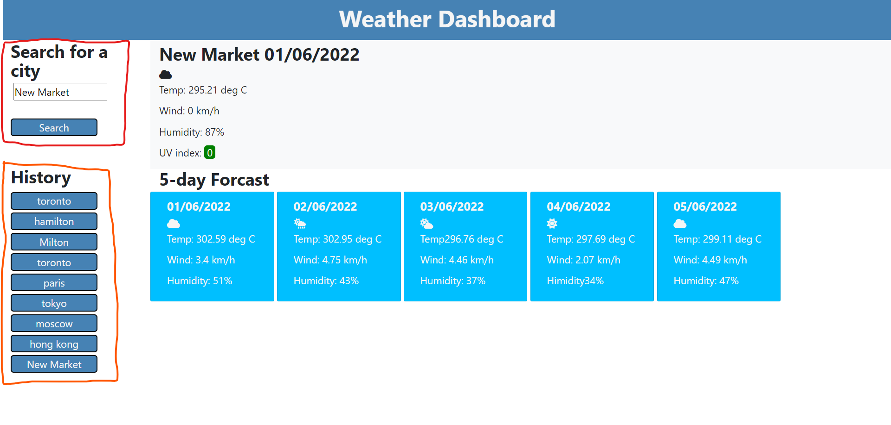

# Weather-Dashboard
## Description

The goal of this assignment was to create a page where you could input a city and, using server APIs, retrieve the current weather condtions and a 5 day forcaste which would be displayed on the page.

## Live Deployment link

The live deployment of the site can be found at: https://pletzjd.github.io/Weather-Dashboard/

## Usage

The site loads with a with an initial location set as toronto as well as loading and previous search history saved in local storage

Typing a city name in the search area (outlined in red below) will iniate a new search and write the new weather forcast for today as well as the five day forcast. A history section (outlined below in orange) gets the new search added to it at the bottom.

The history section can also be interacted with by clicking one of the past results causing the weather data for that history item to be written to the page.

## Credits

Site  developper(s):
- Jordan Pletzer: https://github.com/pletzjd

## License

MIT License

Copyright (c) [2022] [Jordan Daniel Joseph Pletzer]

Permission is hereby granted, free of charge, to any person obtaining a copy
of this software and associated documentation files (the "Software"), to deal
in the Software without restriction, including without limitation the rights
to use, copy, modify, merge, publish, distribute, sublicense, and/or sell
copies of the Software, and to permit persons to whom the Software is
furnished to do so, subject to the following conditions:

The above copyright notice and this permission notice shall be included in all
copies or substantial portions of the Software.

THE SOFTWARE IS PROVIDED "AS IS", WITHOUT WARRANTY OF ANY KIND, EXPRESS OR
IMPLIED, INCLUDING BUT NOT LIMITED TO THE WARRANTIES OF MERCHANTABILITY,
FITNESS FOR A PARTICULAR PURPOSE AND NONINFRINGEMENT. IN NO EVENT SHALL THE
AUTHORS OR COPYRIGHT HOLDERS BE LIABLE FOR ANY CLAIM, DAMAGES OR OTHER
LIABILITY, WHETHER IN AN ACTION OF CONTRACT, TORT OR OTHERWISE, ARISING FROM,
OUT OF OR IN CONNECTION WITH THE SOFTWARE OR THE USE OR OTHER DEALINGS IN THE
SOFTWARE.